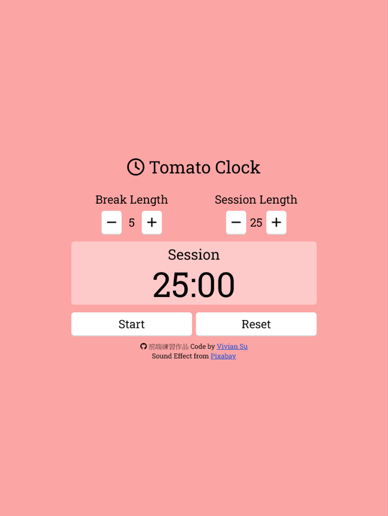

# Tomato Clock (Pomodoro Timer)

Build a Pomodoro Timer using React.

用 React 開發番茄鐘，預設以 25 分鐘工作 5 分鐘休息循環倒數。使用者可調整時間長短，控制倒計時開始暫停、重設。階段結束會響鈴並切換下一階段。

## Table of contents

-   [Table of contents](#table-of-contents)
-   [Overview](#overview)
    -   [The challenge](#the-challenge)
    -   [Screenshot](#screenshot)
    -   [Links](#links)
-   [My process](#my-process)
    -   [Built with](#built-with)
    -   [What I learned](#what-i-learned)
    -   [Useful resources](#useful-resources)
-   [Author](#author)

## Overview

### The challenge

Users should be able to:

-   Set the session length between 1 to 60 minutes (default 25).
-   Set the break length between 1 to 60 minutes (default 5).
-   Click the start button to begin the timer.
-   Click the pause button to pause the timer.
-   Click the reset button to reset all settings.
-   If the timer is paused and users click the start button again, the countdown should resume from where it was paused.
-   When a session countdown reaches zero, a new break countdown should begin, and a sound should play. Similarly, when a break countdown reaches zero, a new session countdown should begin, and a sound should play.
-   Display the countdown period and the time left in a block.

### Screenshot



### Links

-   Live Site URL: [https://yj-pomodoro.netlify.app/](https://yj-pomodoro.netlify.app/)

## My process

### Built with

-   Semantic HTML5 markup
-   [Tailwind CSS](https://tailwindcss.com/)
-   [React](https://reactjs.org/)
-   [Redux Toolkit](https://redux-toolkit.js.org/)
-   [Vite](https://vitejs.dev/)
-   Mobile-first workflow
-   Font Awesome
-   Google fonts
-   [Netlify](https://www.netlify.com/)

### What I learned

-   Use Redux Toolkit to manage state.

```js
// app/store.jsx
export const store = configureStore({
    reducer: {
        clock: clockReducer,
    },
});

// features/clock/clockSlice.jsx
export const clockSlice = createSlice({
    name: "clock",
    initialState,
    reducers: {
        incrementBreak: (state) => {
            if (state.isRunning || state.breakLength === 60) return;
            state.breakLength += 1;
            if (state.period === PERIOD.BREAK) {
                state.timeLeft = handleTimeLeft(state.breakLength);
            }
        },
        ...
    }
});

// main.jsx
ReactDOM.createRoot(document.getElementById("root")).render(
    <React.StrictMode>
        <Provider store={store}>
            <App />
        </Provider>
    </React.StrictMode>
);
```

-   Use components to build a website in React.

```js
// App.jsx
const App = () => {
    ...
    return (
        <div className="clock w-full max-w-lg">
            <Header />
            <main>
                <ClockSetting />
                <ClockDisplay />
                <ClockButtons
                    handleSwitch={handleSwitch}
                    handleReset={handleReset}
                />
                <audio id="beep" ref={audioRef} src={alarm}></audio>
            </main>
            <Footer />
        </div>
    );
};
```

-   Use setInterval to handle the countdown feature.

```js
// start or pause button
const handleSwitch = () => {
    // if 正在倒數 => 停止
    if (clock.isRunning) {
        clearInterval(intervalRef.current);
        dispatch(changeSwitch());
        return;
    }

    // 開始倒數
    dispatch(changeSwitch());
    intervalRef.current = setInterval(countDown, 1000);
};
```

### Useful resources

-   [Vite Crash Course](https://www.youtube.com/watch?v=89NJdbYTgJ8)
-   [How to Setup React and Tailwind CSS with Vite in a Project](https://www.freecodecamp.org/news/how-to-install-tailwindcss-in-react/)
-   [React JS Full Course for Beginners](https://www.youtube.com/watch?v=RVFAyFWO4go&list=PL0Zuz27SZ-6M1Uopt6_VL3gf3cpMnwavm&index=5)
-   [React Redux Full Course for Beginners](https://www.youtube.com/watch?v=NqzdVN2tyvQ&list=PL0Zuz27SZ-6M1Uopt6_VL3gf3cpMnwavm&index=6)
-   [freeCodeCamp - Front End Development Libraries](https://www.freecodecamp.org/learn/front-end-development-libraries/#front-end-development-libraries-projects)

## Author

-   GitHub - [@YingJhen-Su](https://github.com/YingJhen-Su)
-   freeCodeCamp - [@YJS](https://www.freecodecamp.org/YJS)
-   CodePen - [@YJ1997](https://codepen.io/YJ1997)
-   Frontend Mentor - [@YingJhen-Su](https://www.frontendmentor.io/profile/YingJhen-Su)
